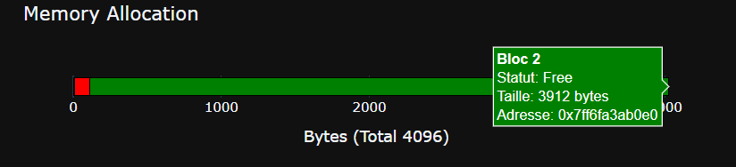

# 🚀 Custom Memory Allocator (C++ & Python)

A high-performance dynamic memory allocator written in C++ from scratch, featuring an interactive visualization dashboard built with Python. This project implements core system-level memory management concepts.

## ✨ Core Features
- **Allocation Strategy**: First Fit.
- **Memory Optimization**:
    - **Splitting**: Efficiently carves large blocks into smaller ones.
    - **Coalescence**: Automatically merges adjacent free blocks to prevent fragmentation.
- **Performance**: 8-byte memory alignment for CPU efficiency.
- **Visualization Suite**:
    - **Static View**: Quick heap snapshots using `Matplotlib`.
    - **Interactive Dashboard**: Modern HTML/JavaScript dashboard using `Plotly` (includes hover data like memory addresses and block status).
- **Robustness**: Stress-tested with thousands of randomized allocation/deallocation cycles.

## 📁 Project Structure
- `src/` & `include/`: The C++ allocator engine.
- `scripts/`: Python tools for data processing and visualization.
- `docs/`: (Optional) Project documentation and screenshots.

## 🚀 Getting Started

### 1. Build and Run (C++)
Ensure you have a C++ compiler and CMake installed:
```bash
# Compile the project
cmake -B build
cmake --build build

# Run the allocator & stress test
./build/MemoryAllocator

2. Visualization (Python)
Install the required dependencies and run the visualizer:

Bash
pip install matplotlib plotly
python scripts/visualizer.py
📊 Visualization Preview
The Plotly-based dashboard allows you to inspect the heap in real-time:

Red Blocks: Allocated memory (Busy).

Green Blocks: Available memory (Free).

Tooltips: Hover over blocks to see exact hexadecimal addresses and sizes.

Created as a system programming study project.